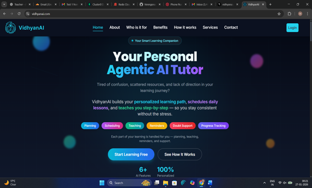

🌐 **Website Link:** [api.vidhyanai.com](https://api.vidhyanai.com)

The Autonomous AI-Powered Teaching Platform is an intelligent, agent-based learning system designed to deliver personalized, automated, and adaptive education using Agentic Artificial Intelligence.
The platform uses multiple autonomous AI agents to manage lesson planning, content generation, scheduling, doubt resolution, notifications, and progress tracking with minimal human intervention.

🎯 Key Objectives
      Deliver personalized learning paths based on user preferences and progress
      Automate daily learning sessions with scheduling and notifications
      Generate AI-driven lessons dynamically instead of static content
      Provide real-time doubt resolution using contextual understanding
      Maintain continuous progress tracking for adaptive learning

🧠 Core Features
      Agentic AI Architecture with autonomous collaborating agents
      Dynamic Roadmap Generation for selected learning fields
      AI-Generated Lessons using LLMs and Retrieval Augmented Generation (RAG)
      Automated Scheduling & Notifications
      Context-Aware Doubt Resolution
      Progress Tracking & Visualization Dashboard
      Dark & Light Mode Support
      Source-Referenced Learning Content

🏗️ System Architecture
      The platform follows a microservices-based, agent-oriented architecture:
      Frontend: React.js (real-time AI lesson streaming via SSE)
      Backend: FastAPI (REST APIs)
      AI Layer: ML_Service with embeddings, RAG, and LLM integration
      Inter-Agent Communication: Redis (Pub/Sub)
      Database: MongoDB (users, lessons, progress, embeddings)
      Each AI agent operates independently and collaborates using event-driven communication.

🤖 Autonomous AI Agents
      Planning Agent – Controls learning flow and topic sequencing
      Roadmap Generation Agent – Creates structured learning paths
      Lesson Generation Agent – Produces AI-generated lessons
      Google Search Agent – mining real-time content
      Doubt Agent – Resolves learner queries contextually
      Scheduling Agent – Triggers sessions at preferred times
      Notification Agent – Sends session reminders
      Storing Agent – Manages persistent data storage

🧩 ML_Service (Central Intelligence Layer)
      The ML_Service acts as the brain of the system:
      Generates text embeddings using FastEmbed
      Performs semantic retrieval using cosine similarity
      Implements Retrieval Augmented Generation (RAG)
      Builds structured prompts
      Uses Gemini-2.5-Flash for lesson and explanation generation
      This ensures context-aware, non-repetitive, and personalized learning.

🔐 Authentication & Onboarding
      OTP-based secure authentication
      User profile creation
      Learning field selection
      Preferred daily learning time setup

📊 Learning Dashboard
      AI-generated lesson interface
      Session status tracking
      Topic-wise learning navigation
      Progress visualization (percentage & topic completion)
      Integrated doubt-asking interface
      Source references for credibility

🧪 Results
      Fully functional AI-driven teaching flow
      Automated daily learning sessions
      Real-time lesson generation
      Accurate and contextual doubt resolution
      Consistent progress tracking across sessions

🚀 Future Scope
      Image-based & visual learning support
      Multimodal learning (text, audio, video)
      Adaptive difficulty adjustment
      AI-based quizzes & assessments
      Voice-based interaction
      Mobile application
      Collaborative learning features
      Advanced learning analytics
      Institutional & enterprise deployment

🛠️ Technologies Used
      Frontend: React.js
      Backend: FastAPI
      Database: MongoDB
      Caching & Messaging: Redis
      AI Models: Gemini-2.5-Flash
      Embeddings: FastEmbed (BAAI/bge-small-en-v1.5)
      Architecture: Microservices + Agentic AI

👨‍🎓 Authors
      Hiren Jayanti Gorasia
      Makavana Mohitkumar Nitinbhai
      Bachelor of Technology – Computer Engineering
      Marwadi University, Rajkot (2025–26)
      
# VidhyanAI 🚀
**Learn Smarter with Autonomous AI**

